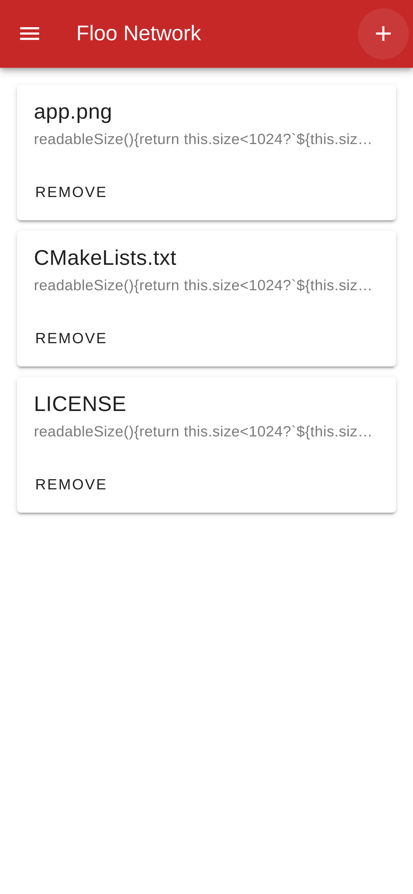

# Floo Network Web

The web frontend of the [Floo Network Project](https://github.com/TaipaXu/floo-network).

English | [中文](./README_ZH.md)



## Prerequisites

Ensure you are using `Node.js` version `20.17.0`. You can manage multiple versions of `Node.js` with a version manager like `nvm`.

```sh
nvm install 20.17.0
nvm use 20.17.0
```

```sh
git clone https://github.com/TaipaXu/floo-network-web.git
cd floo-network-web
```

### Development

```sh
pnpm run dev
```

### Build

```sh
pnpm run build
```

## License

[GPL-3.0](LICENSE)
