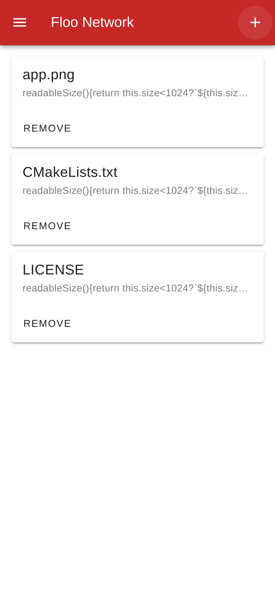

# 飞路网网页端

[飞路网项目](https://github.com/TaipaXu/floo-network)的网页端。

[English](./README.md) | 中文



## 准备

确保你使用的是`Node.js`版本`20.17.0`。你可以使用像`nvm`这样的版本管理器来管理多个`Node.js`版本。

```sh
nvm install 20.17.0
nvm use 20.17.0
```

```sh
git clone https://github.com/TaipaXu/floo-network-web.git
cd floo-network-web
```

### 开发

```bash
pnpm run dev
```

### 构建

```bash
pnpm run build
```

## 协议

[GPL-3.0](LICENSE)
